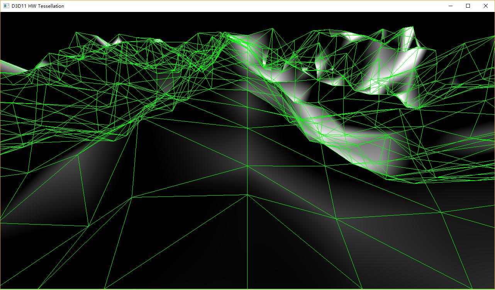

## Overview
- It is used to demo D3D11 HW Tessellation.
  - What is HW Tessellation ?
  - How to Control HW Tessellation by API and Shader ?
- It is to explore new algorithms taking advantage of HW Tessellation.
- No material, Lighting model involved.

## Design 
We need a flexible design which is easy to extend the capability of adding new features.
It depends upon a clear abstraction of whole process. We may need an unified interface to 
handle all kinds of mesh data so that coding on interface other than raw data. It is also 
important to collect and dispatch user's input clearly. Features involve combination of 
different shader objects. It plays an important role in architecture design.
  
### Mesh Data Management
- Data source such quad, bezier patch is independent of APP logic.
  - All Data Sources provide an unified interface. 
  - APP use this interface feed data into tessellation pipe.
  
  
  
### Shader Management
It may apply different effects to different mesh. An effect must contains vertex shader, pixel shader.
It may also contain geometry shader, hull shader and domain shader. Different effects may have different
constant buffers which need to update in each frame.

- class *Shader* serves the purpose of container of all kinds of shader instances in an effect file.
- class *ShaderContainer* is something like container of all instanced effect files.
- Shader objects are queried from those two container when rendering each frame.
- Constant buffer Update
  - All effects share the same constant buffer structure.
  - It simplify the design.

```
struct FrameParam
{
    DirectX::XMFLOAT4X4  cbWorld;
    DirectX::XMFLOAT4X4  cbViewProjection;
    DirectX::XMFLOAT3    cbCameraPosWorld;
    float cbTessellationFactor;
    int   cbWireframeOn;
    int   cbHeightMapOn;
    int   cbDiagType;
    float cbTexelCellU;
    float cbTexelCellV;
    float cbWorldCell;
};

```

### Render Option Management
Render option provides a way for user to instruct rendering process. Some options may involve 
render state change in GPU. Some may only affect code flow in CPU. I don't tell one from 
another at first stage. All GPU involved options will be updated as part of constant buffer.

- class *RenderOption* is designed to handle render options specified by user.
- It is implemented as a singleton pattern to ensure globally single instance. 

```
struct RenderOption
{
    bool wireframeOn;
    bool diagModeOn;
    bool fixedCamera;
    int  heightMapOn;
    int  tessellateFactor;
    DiagType diagType;
    DirectX::XMMATRIX  world;

    RenderOption::RenderOption()
        : wireframeOn(false)
        , diagModeOn(false)
        , fixedCamera(false)
        , heightMapOn(1)
        , tessellateFactor(10)
        , diagType(eDiagNormal)
    { }

    static RenderOption& getRenderOption();
};

```
  
## Control
All user controls are done by key stroke.

- ESC/q	: exit app.
- w		: wire-frame mode.
- t     : increase tessellation factor.
- h     : apply height map.
- f     : fixed camera.
- d     : switch between diag modes.


## Demo 
Waiting for Update...    



## References
-  [Tessellation in D3D11@GDC](https://www.gdcvault.com/play/1012740/Direct3D-11-In-Depth-Tutorial)
